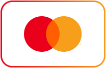
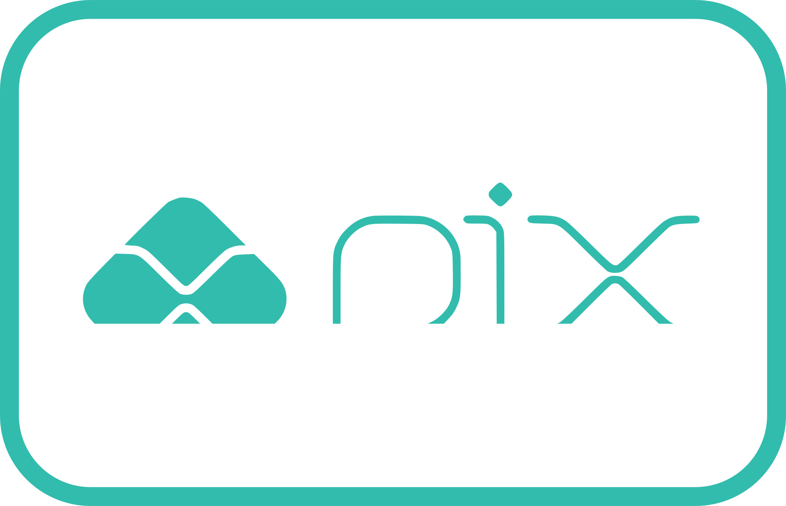

# Payment Logos 💳 ✨

Vector SVG payment logos used at [GEIGRO](https://geigro.com).

---

### 📌 Shortcuts:
- [Debit & credit cards](#debit--credit-cards)
- [Wallets & Express Checkout](#wallets--express-checkout)
- [Bank transfers & Instant Payments](#bank-transfers--instant-payments)
- [Buy Now Pay Later (BNPL)](#buy-now-pay-later-bnpl)
- [Usage & CDN Integration](#-usage--cdn-integration)

---

## Debit & credit cards

| Asset | Name | Path |
| :---: | :--- | :--- |
|  | American Express | `icons/cards/american-express.svg` |
|  | Discover | `icons/cards/discover.svg` |
|  | JCB | `icons/cards/jcb.svg` |
|  | Mastercard | `icons/cards/mastercard.svg` |
|  | UnionPay | `icons/cards/unionpay.svg` |
|  | Visa | `icons/cards/visa.svg` |

---

## Wallets & Express Checkout

| Asset | Name | Path |
| :---: | :--- | :--- |
|  | Alipay | `icons/wallets/alipay.svg` |
|  | Amazon Pay | `icons/wallets/amazon-pay.svg` |
|  | Apple Pay | `icons/wallets/apple-pay.svg` |
|  | Cash App | `icons/wallets/cash-app.svg` |
|  | Google Pay | `icons/wallets/google-pay.svg` |
|  | Link (Stripe) | `icons/wallets/link.svg` |
|  | PayPal | `icons/wallets/paypal.svg` |
|  | Revolut | `icons/wallets/revolut.svg` |
|  | WeChat Pay | `icons/wallets/wechat-pay.svg` |

---

## Bank transfers & Instant Payments

| Asset | Name | Path |
| :---: | :--- | :--- |
|  | Pix | `icons/bank-transfer/pix.svg` |
|  | SEPA Direct Debit | `icons/bank-transfer/sepa.svg` |
|  | Wero | `icons/bank-transfer/wero.svg` |

---

## Buy Now Pay Later (BNPL)

| Asset | Name | Path |
| :---: | :--- | :--- |
|  | Affirm | `icons/bnpl/affirm.svg` |
|  | Klarna | `icons/bnpl/klarna.svg` |

---

## 🚀 Usage & CDN Integration

### Raw GitHub URL
```html
/<repo>/main/icons/wallets/paypal.svg" height="32" alt="PayPal" />
```

### jsDelivr CDN
```html
/<repo>@main/icons/cards/visa.svg" height="32" alt="Visa" />
```

---

## ⚖️ License & Trademarks

This repository is distributed under the [MIT License](LICENSE).  
All brand logos, names, and registered trademarks belong to their respective owners and are provided solely for payment checkout integration purposes.


